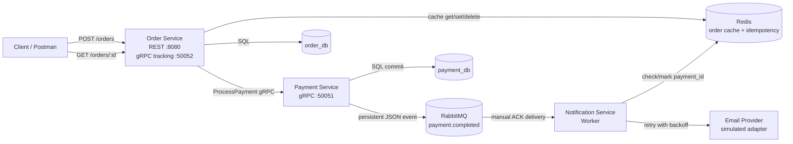

# ADP2 Assignment 4 - Caching and Background Jobs

This project contains three Go microservices:

- `order-service`: exposes the REST API, calls the payment service through gRPC, and caches order detail reads in Redis.
- `payment-service`: processes payments and publishes `payment.completed` events to RabbitMQ after successful payments.
- `notification-service`: consumes payment events as a background worker, sends notifications through a provider adapter, retries transient failures, and stores idempotency state in Redis.

## Architecture Flow



## Redis Cache-Aside Strategy

- `GET /orders/:id` checks Redis first using the key `orders:{id}`.
- On a cache miss, the order service loads the order from PostgreSQL and stores the JSON value in Redis with `ORDER_CACHE_TTL` (`5m` in Docker Compose).
- Whenever an order status changes after payment authorization/failure or cancellation, the order service deletes `orders:{id}` immediately after the database update. The next read repopulates Redis with fresh data.
- If Redis returns a non-miss error during a read, the service falls back to PostgreSQL so cache trouble does not break the API.

## Reliability Design

- The payment service declares a durable `payment.completed` queue and publishes persistent messages.
- Publisher confirms are enabled, so payment only returns success after RabbitMQ confirms the event.
- The notification service consumes with `autoAck=false`.
- Notification sending is handled by a `NotificationProvider` interface. `PROVIDER_MODE=SIMULATED` initializes an adapter that sleeps and randomly fails to behave like an unstable external provider.
- The worker retries provider failures with exponential backoff. With the default values it tries up to `3` times with delays of `2s`, then `4s`.
- Duplicate events are filtered by Redis idempotency keys named `notifications:payment:{payment_id}`. Successfully sent notifications are marked `sent` for `NOTIFICATION_IDEMPOTENCY_TTL`.
- The notification service acknowledges a message only after the provider succeeds and the Redis idempotency record is marked sent. If retries are exhausted, the message is NACKed for RabbitMQ redelivery.
- Order and payment services handle `SIGINT` / `SIGTERM` and shut down HTTP, gRPC, RabbitMQ, and database resources cleanly.

## Docker Setup Instructions

### 1. Install Docker Desktop

Download Docker Desktop for Windows:

https://www.docker.com/products/docker-desktop/

During installation, keep the WSL 2 backend option enabled. After installation, restart your computer if Docker asks you to.

### 2. Start Docker Desktop

Open Docker Desktop and wait until it says Docker is running.

Check it from PowerShell:

```powershell
docker --version
docker compose version
```

Both commands should print versions.

### 3. Open the project folder

```powershell
cd "D:\VSC Projects\ADP2\Assignment 2\Assignment-1_ADP2"
```

### 4. Build and start everything

```powershell
docker compose up --build
```

This starts:

- `order-db` on local port `5433`
- `payment-db` on local port `5434`
- `rabbitmq` on local ports `5672` and `15672`
- `redis` on local port `6379`
- `payment-service` on local port `50051`
- `order-service` on local ports `8080` and `50052`
- `notification-service`

RabbitMQ management UI:

```text
http://localhost:15672
username: guest
password: guest
```

### 5. Test the event flow

Send an order request:

```powershell
curl -X POST http://localhost:8080/orders `
  -H "Content-Type: application/json" `
  -d "{\"customer_id\":\"cust-001\",\"customer_email\":\"user@example.com\",\"item_name\":\"Mechanical Keyboard\",\"amount\":9999}"
```

Expected result:

- The order service creates the order.
- The payment service authorizes the payment.
- RabbitMQ receives a `payment.completed` message.
- The notification worker retries simulated provider failures if needed, then logs something like:

```text
[Notification] Sent email to user@example.com for Order #<order-id>. Amount: $99.99. Status: completed
```

Read the order through the cached endpoint:

```powershell
curl http://localhost:8080/orders/<order-id>
```

### 6. View service logs

In another terminal:

```powershell
docker compose logs -f notification-service
docker compose logs -f payment-service
docker compose logs -f order-service
```

### 7. Stop the project

```powershell
docker compose down
```

To delete database and RabbitMQ volumes and start with a clean database:

```powershell
docker compose down -v
```

Use `docker compose down -v` if you previously started the project before the `customer_email` column was added, because Postgres only runs init migrations when the volume is first created.

## Local Environment Files

Example environment files are available at:

- `services/order/.env.example`
- `services/payment/.env.example`
- `services/notification/.env.example`

The real `.env` files are ignored by Git.
