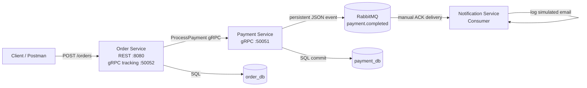

# ADP2 Assignment 3 - Event-Driven Architecture with RabbitMQ

This project contains three Go microservices:

- `order-service`: exposes the REST API and calls the payment service through gRPC.
- `payment-service`: processes payments and publishes `payment.completed` events to RabbitMQ after successful payments.
- `notification-service`: consumes payment events from RabbitMQ and simulates sending an email by logging the notification.

The bonus Dead Letter Queue task is intentionally not included.

## Event Flow



## Reliability Design

- The payment service declares a durable `payment.completed` queue and publishes persistent messages.
- Publisher confirms are enabled, so payment only returns success after RabbitMQ confirms the event.
- The notification service consumes with `autoAck=false`.
- The notification service acknowledges a message only after the notification log is printed.
- Duplicate events are filtered by `event_id` using an in-memory idempotency store. If the same event is redelivered, the service ACKs it without printing the email twice.
- Order and payment services handle `SIGINT` / `SIGTERM` and shut down HTTP, gRPC, RabbitMQ, and database resources cleanly.

## Docker Setup Instructions

### 1. Install Docker Desktop

Download Docker Desktop for Windows:

https://www.docker.com/products/docker-desktop/

During installation, keep the WSL 2 backend option enabled. After installation, restart your computer if Docker asks you to.

### 2. Start Docker Desktop

Open Docker Desktop and wait until it says Docker is running.

Check it from PowerShell:

```powershell
docker --version
docker compose version
```

Both commands should print versions.

### 3. Open the project folder

```powershell
cd "D:\VSC Projects\ADP2\Assignment 2\Assignment-1_ADP2"
```

### 4. Build and start everything

```powershell
docker compose up --build
```

This starts:

- `order-db` on local port `5433`
- `payment-db` on local port `5434`
- `rabbitmq` on local ports `5672` and `15672`
- `payment-service` on local port `50051`
- `order-service` on local ports `8080` and `50052`
- `notification-service`

RabbitMQ management UI:

```text
http://localhost:15672
username: guest
password: guest
```

### 5. Test the event flow

Send an order request:

```powershell
curl -X POST http://localhost:8080/orders `
  -H "Content-Type: application/json" `
  -d "{\"customer_id\":\"cust-001\",\"customer_email\":\"user@example.com\",\"item_name\":\"Mechanical Keyboard\",\"amount\":9999}"
```

Expected result:

- The order service creates the order.
- The payment service authorizes the payment.
- RabbitMQ receives a `payment.completed` message.
- The notification service logs something like:

```text
[Notification] Sent email to user@example.com for Order #<order-id>. Amount: $99.99. Status: completed
```

### 6. View service logs

In another terminal:

```powershell
docker compose logs -f notification-service
docker compose logs -f payment-service
docker compose logs -f order-service
```

### 7. Stop the project

```powershell
docker compose down
```

To delete database and RabbitMQ volumes and start with a clean database:

```powershell
docker compose down -v
```

Use `docker compose down -v` if you previously started the project before the `customer_email` column was added, because Postgres only runs init migrations when the volume is first created.

## Local Environment Files

Example environment files are available at:

- `services/order/.env.example`
- `services/payment/.env.example`
- `services/notification/.env.example`

The real `.env` files are ignored by Git.
