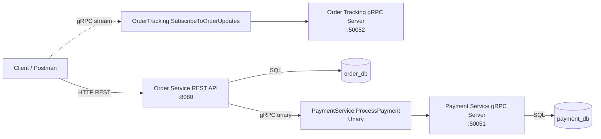

# ADP2 Assignment 2 - Switch from REST to gRPC

This project contains two Go microservices:

- `order-service`: exposes REST endpoints for end users and uses gRPC internally to call the payment service.
- `payment-service`: exposes a gRPC server for payment processing.

The order service also exposes a gRPC tracking server for order status updates.

## Proto Repositories

The shared protobuf-generated Go packages used by both services come from:

- Shared proto repository: https://github.com/Casper-242464/ConvertedProtosRepo
- Payment proto package: https://github.com/Casper-242464/ConvertedProtosRepo/tree/main/proto/payment
- Order proto package: https://github.com/Casper-242464/ConvertedProtosRepo/tree/main/proto/order

## Services and Ports

- `order-service` REST API: `http://localhost:8080`
- `order-service` gRPC tracking server: `localhost:50052`
- `payment-service` gRPC server: `localhost:50051`
- PostgreSQL database for orders: `order_db`
- PostgreSQL database for payments: `payment_db`

## How to Run

### 1. Prerequisites

Make sure these are installed locally:

- Go `1.24`
- PostgreSQL

### 2. Create the databases

Create two PostgreSQL databases:

- `order_db`
- `payment_db`

### 3. Run the SQL migrations

Apply the migration files:

- `services/order/migrations/001_init.sql` on `order_db`
- `services/payment/migrations/001_init.sql` on `payment_db`

Example using `psql`:

```powershell
psql -U postgres -d order_db -f services/order/migrations/001_init.sql
psql -U postgres -d payment_db -f services/payment/migrations/001_init.sql
```

### 4. Configure environment variables

Create `.env` files from the provided examples:

```powershell
Copy-Item services/payment/.env.example services/payment/.env
Copy-Item services/order/.env.example services/order/.env
```

The gRPC addresses and ports are loaded from environment variables. They must not be hardcoded in source code.

### 5. Start the payment service first

The order service depends on the payment gRPC server configured in `services/order/.env`.

```powershell
cd services/payment
go mod download
go run ./cmd/app
```

### 6. Start the order service

Open a second terminal:

```powershell
cd services/order
go mod download
go run ./cmd/app
```

### 7. Test the REST API with Postman

The order service exposes these HTTP endpoints for end users:

- `POST /orders`
- `PATCH /orders/:id/cancel`
- `GET /orders?min_amount=<value>&max_amount=<value>`

Example request:

```powershell
curl -X POST http://localhost:8080/orders `
  -H "Content-Type: application/json" `
  -d "{\"customer_id\":\"cust-001\",\"item_name\":\"Mechanical Keyboard\",\"amount\":25000}"
```

The Postman collection is available here:

- `postman/postman_examples.json`

### 8. Available gRPC APIs

- `payment-service`: unary `ProcessPayment`
- `order-service`: server-streaming `SubscribeToOrderUpdates`

## Architecture Diagram



## Communication Summary

- Client to order service: HTTP/REST
- Order service to payment service: gRPC unary call
- Client to order tracking server: gRPC server-streaming call
- Services to databases: PostgreSQL

## Notes

- `order-service` keeps the external REST API for end users.
- gRPC server address and port configuration is loaded from environment variables or `.env` files.
